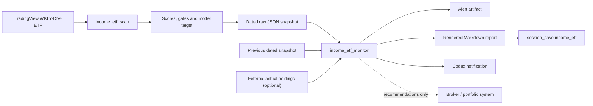

# Income ETF Operations and Monitoring

## Purpose

This document defines the operating model for the income ETF accumulation strategy:

- Run the TradingView income ETF universe on a repeatable cadence.
- Rank funds by NAV-aware economic quality rather than headline yield.
- Build a score-driven model target with no required symbol count.
- Reinvest distributions during accumulation.
- Compare each scan with the prior dated snapshot.
- Notify on material qualification, NAV, score, distribution, and allocation changes.
- Optionally compare model targets with an externally supplied actual portfolio.
- Never place or imply execution of brokerage orders.

The TradingView MCP owns market-data collection, scoring, model targets, scan history, and recommendations. It does not own the brokerage portfolio.

## System boundary



### State ownership

| State | Owner | Persistence |
|---|---|---|
| TradingView metrics | TradingView | TradingView |
| Scores and qualification | Income scanner | Recomputed each run |
| Model target allocations | Income scanner | Raw dated scan |
| Scan-to-scan alerts | Income monitor | Dated alert artifact |
| Actual holdings and cash | Broker or external portfolio store | External only |
| Rebalance recommendations | Income monitor | Returned for the current run |
| Trade execution | Broker/user | Never performed by this workflow |

## Tools

### `income_etf_scan`

Reads the configured TradingView tabs, merges rows by ticker, calculates scores, applies qualification gates, and builds the model target.

```text
income_etf_scan
  screener_name="WKLY-DIV-ETF"
  frequency="all"
  portfolio_value=100000
  min_score=55
  maximum_position_pct=8
  maximum_exposure_pct=30
```

The scan automatically saves:

```text
reports/inc-etf/<YYYY-WkNN>/scan-income_etf.json
```

### `income_etf_monitor`

Runs the scan, loads the most recent earlier dated snapshot, creates alerts, and optionally compares model targets with actual holdings.

```text
income_etf_monitor
  screener_name="WKLY-DIV-ETF"
  frequency="all"
  portfolio_value=100000
```

The monitor automatically saves alert metadata:

```text
reports/inc-etf/<YYYY-WkNN>/income_etf-alerts.json
```

The dedicated weekly folder therefore keeps the complete income workflow together:

```text
reports/inc-etf/<YYYY-WkNN>/
  income_etf.md
  scan-income_etf.json
  income_etf-alerts.json
```

Monthly governance reviews are separate:

```text
reports/inc-etf/Mon-review/<YYYY-Mon>/
  monthly-review.md
  monthly-review.json
```

The alert artifact does not contain actual holdings.

## Operating cadence

| Cadence | Operation | Decision policy |
|---|---|---|
| Daily | Exception run only | Investigate severe market, NAV, liquidity, or issuer events |
| Weekly | Full monitor, report, and notification | Update qualification and model targets; do not force turnover |
| Monthly | Review four weekly reports | Consider target changes and external portfolio drift |
| Quarterly | Issuer-level due diligence | Review ROC, SEC yield, fees, prospectus, distribution history, and tax fit |

Recommended weekly run: Saturday after Friday's closing data.

### Turnover controls

- A new candidate should normally qualify on two consecutive weekly scans before funding.
- A critical hard-gate failure is reviewed immediately.
- A normal score decline should persist for two scans before discretionary replacement.
- Formal rebalancing occurs monthly unless a critical condition requires earlier action.
- Retained cash is not forced into lower-quality candidates.

## Scanner alerts

These alerts do not require actual portfolio data.

| Alert | Default trigger | Severity |
|---|---|---|
| Model entry | Ticker newly appears in model target | Info |
| Model exit | Prior model ticker disappears from target | Critical |
| Score move | Absolute score change of at least 10 points | Warning when down, info when up |
| Severe drawdown | One-month NAV total return at or below -12% | Critical |
| Drawdown watch | One-month NAV total return at or below -10% | Warning |
| Indicated-yield move | At least 20% relative and 2 percentage points absolute | Warning |
| Frequency change | Weekly/monthly frequency changes | Warning |
| Model cash move | Cash target changes by at least 5 percentage points | Warning |

An indicated-yield alert is not proof of a distribution cut or increase. Confirm the issuer's declared distribution before classifying the event.

## External portfolio contract

Actual holdings may be passed to `income_etf_monitor` for one run:

```json
{
  "as_of": "2026-07-25",
  "cash": 23000,
  "positions": [
    {
      "ticker": "SPYI",
      "market_value": 8000,
      "shares": 125,
      "cost_basis": 7600
    }
  ]
}
```

Required fields:

- Portfolio: `cash`, `positions`
- Position: `ticker`, `market_value`

Optional fields:

- Portfolio: `as_of`
- Position: `shares`, `cost_basis`

The provider may be a read-only broker API, Google Sheet, broker CSV adapter, or another portfolio service. Provider authentication and portfolio persistence remain outside this MCP.

### Broker-exported CSV

`income_etf_monitor` can read a broker CSV directly:

```text
income_etf_monitor
  screener_name="WKLY-DIV-ETF"
  actual_portfolio_csv_path="C:/work/tradingview-mcp-jackson/CSV/PORTFOLIO-ETF_WK.csv"
  allow_additional_funding=true
  taxable_account=true
  gradual_reconciliation=true
```

Supported header aliases:

| Portfolio field | Accepted CSV headers |
|---|---|
| Ticker | `Ticker`, `Symbol` |
| Market value | `Mkt Value`, `Market Value`, `Current Value` |
| Shares, optional | `Sh`, `Shares`, `Quantity`, `Qty` |
| Cost basis, optional | `Total Cost`, `Cost Basis`, `Cost` |

Formatting such as `$4,406`, `(394)`, and quoted fields is normalized. Multiple rows with the same ticker are treated as separate lots/accounts and aggregated into one position before drift is calculated.

Position-only exports commonly omit cash. Supply a known balance through `actual_portfolio_cash`; when omitted, the monitor reports cash as unknown rather than assuming zero. Set `allow_additional_funding=true` for a margin account or a workflow where new capital can be added. Buy recommendations will then remain unconstrained by the reported cash balance, and the output will estimate gross buys, gross sales, and any net external funding requirement. This setting never borrows funds or submits a trade.

The CSV is read transiently and remains the external source of truth. Its rows are not copied into the alert artifact.

### Taxable-account gradual reconciliation

Set both `taxable_account=true` and `gradual_reconciliation=true` for a regular taxable brokerage account. The monitor then treats full-target drift as a destination rather than an immediate trade list:

- Loss positions outside the target become `HARVEST_LOSS_REVIEW`
- Loss positions above target become `LOSS_AWARE_TRIM`
- Gain positions outside the target become `DEFER_OR_OFFSET_GAIN`
- Adds and new buys remain gradual funding candidates

The CSV provides aggregate cost basis by ticker but not acquisition dates, adjusted tax-lot basis, or short-term versus long-term status. The output therefore cannot calculate exact tax liability. Confirm specific lots, wash-sale exposure, return-of-capital basis adjustments, and holding periods with broker tax-lot records before acting. Temporarily disabling automatic reinvestment may be necessary around a planned loss sale because purchases of substantially identical shares within the wash-sale window can defer the loss.

## Rebalance recommendations

When actual holdings are supplied, the monitor calculates:

- Actual portfolio value and cash percentage
- Cash status (`reported` or `not_reported`) and buying-power policy
- Target and actual weight per ticker
- Percentage-point drift
- Target value
- Suggested value change
- Gross suggested buys/sales and estimated external funding requirement
- Aggregate estimated unrealized gain/loss and a tax-aware transition action
- Recommendation: `HOLD`, `ADD`, `TRIM`, `BUY_CANDIDATE`, or `REVIEW_EXIT`

Default drift trigger:

- Relative drift of at least 20% of target, and
- Absolute drift of at least 0.5 percentage points

Additional warnings:

- Actual holding absent from the model target
- Actual position above the configured maximum position

All outputs are recommendations. No order is created, staged, routed, or submitted.

## Report pipeline

The monitor follows the standard strategy-report path:

1. Produce deterministic structured scan values.
2. Save the complete raw scan.
3. Compare it with the previous dated scan.
4. Save alert metadata.
5. Render the Markdown narrative using the returned instruction.
6. Call `session_save instrument_type="income_etf"`.
7. Write:

```text
reports/inc-etf/<YYYY-WkNN>/income_etf.md
```

Required report sections:

1. Portfolio Decision
2. Executive Snapshot
3. Change Alerts
4. Selected Portfolio
5. Why Cash Is Retained
6. Exposure Review
7. Watchlist
8. Rebalance Recommendations, when actual holdings are supplied
9. Reinvestment Projection
10. Portfolio Actions

The renderer must use the scanner's scores, allocation, cash, and projection values without recalculating them.

## Notifications

The weekly Codex automation runs the monitor and surfaces:

- Critical alerts first
- Warning alerts second
- Informational entries last
- A concise no-action message when no critical or warning alerts exist
- Failures when TradingView, the screener, raw persistence, report rendering, or report saving fails

Optional downstream channels can be added later:

- Gmail draft for critical alerts
- Slack or Teams message
- Broker/provider-specific notification

Automatic sending and trade execution require separate explicit authorization.

## Failure handling

| Failure | Required behavior |
|---|---|
| TradingView unavailable | Stop; do not reuse stale results |
| Screener missing | Stop and identify `WKLY-DIV-ETF` |
| A tab cannot be read | Stop or mark scan incomplete; do not publish a normal report |
| No prior snapshot | Establish baseline and emit informational alert |
| Raw scan cannot be saved | Report failure; do not claim monitoring history is current |
| External holdings malformed | Reject the holdings comparison; preserve scanner result |
| Report save fails | Keep raw/alert artifacts and surface the failure |

## Monthly and quarterly checklist

### Monthly

- Compare the four weekly qualification sets.
- Confirm new candidates persisted for two scans.
- Review actual-versus-target drift if holdings are available.
- Confirm distribution changes with issuer declarations.
- Review cash deployment without forcing full investment.

### Quarterly

- Review issuer distribution history.
- Review 19a-1 return-of-capital estimates.
- Compare distribution rate with 30-day SEC yield.
- Compare NAV total return with the underlying index.
- Review fees, AUM, liquidity, and strategy changes.
- Review correlation and duplicated exposure.
- Confirm tax-account suitability.

## Safety principles

- Distribution rate is not total return.
- Return of capital may reduce NAV.
- Weekly payment frequency is not a quality signal.
- Model qualification is not proof of suitability for a specific investor.
- The external broker or portfolio system remains the source of truth.
- Rebalance output is advisory and requires user review.
